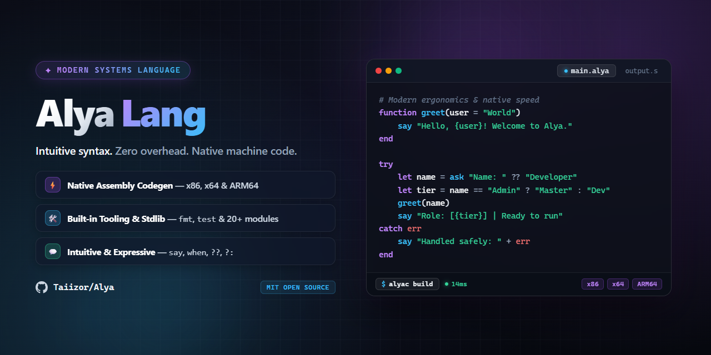

<div align="center">



# Alya

**A simple, intuitive, and modern multi-platform compiled programming language.**

[](https://github.com/Taiizor/Alya/actions/workflows/ci.yml)
[](https://github.com/Taiizor/Alya/releases)
[](https://www.rust-lang.org/)
[](LICENSE)
[](#platform--architecture-matrix)

<p align="center">
  <a href="#key-features">Key Features</a> •
  <a href="#installation">Installation</a> •
  <a href="#cli-usage">CLI Usage</a> •
  <a href="#language-tour">Language Tour</a> •
  <a href="#platform--architecture-matrix">Platforms</a> •
  <a href="#contributing">Contributing</a>
</p>

</div>

---

## Overview

**Alya** is designed to provide clean, readable syntax inspired by natural language without compromising performance. Written in Rust, the `alyac` compiler generates native assembly (GNU syntax) for multiple targets and links with GCC to produce standalone native binaries.

---

## Key Features

- 🌟 **Expressive & Readable**: English-like keywords (`say`, `ask`, `when`, `repeat`, `function`).
- 🛡️ **Exception Handling**: Built-in `try ... catch [err] ... end` support with runtime division/modulo by zero protection.
- ⚡ **Direct Native Codegen**: Emits clean, comment-annotated assembly for **x64**, **x86 (32-bit)**, and **ARM64**.
- 🛠️ **Built-in Functions**: Math intrinsics (`abs`, `min`, `max`, `sqrt`, `pow`), formatting (`print`, `println`), string conversions (`str`, `int`), and string length (`len`).
- 💬 **Flexible Comments**: Supports Python-style `#`, C-style `//`, and multiline `/* ... */` comments.
- 🔄 **Compound Operators**: Native `+=`, `-=`, `*=`, and `/=` assignments.
- 🎯 **Rich CLI**: Subcommands for direct execution (`run`), building binaries (`build`), syntax validation (`check`), and AST/token visualization (`ast`, `tokens`).
- 🔍 **Helpful Diagnostics**: Informative error output with source code line numbers and error indicators.

---

## Installation

### Pre-built Binaries

Download pre-built standalone binaries for Linux, macOS, and Windows directly from our [GitHub Releases](https://github.com/Taiizor/Alya/releases).

### Building from Source

Ensure you have [Rust](https://rustup.rs/) (1.75+) and GCC / MinGW installed:

```bash
# Clone the repository
git clone https://github.com/Taiizor/Alya.git
cd Alya

# Build the release binary
cargo build --release

# The compiled binary will be available at target/release/alyac
# Optionally install it to your Cargo bin directory:
cargo install --path .
```

---

## CLI Usage

The `alyac` compiler provides an intuitive command-line interface:

```text
Usage: alyac [command] [options] <file.alya>

Commands:
  build <file>             Compile directly to a native executable
  run <file>               Compile and immediately execute the program
  check <file>             Validate source code syntax without generating code
  ast <file>               Display the Abstract Syntax Tree (AST)
  tokens <file>            Print token stream generated by the lexer

Options:
  -o, --output <file>      Specify output assembly or executable filename
  -b, --binary             Produce a linked binary executable
  -S, --asm                Produce assembly source code (.s) (default when no command)
  -r, --run                Run the compiled program immediately
      --check              Only check syntax and parse without code generation
      --ast                Print AST structure
      --tokens             Print lexer token stream
  -q, --quiet              Suppress banner and informational compiler output
      --arch <arch>        Target architecture: x64 (default), x86, arm64
      --os <os>            Target operating system: windows, linux, macos
  -h, --help               Display help information
  -v, --version            Display compiler version
```

### Examples

```bash
# Compile and run immediately
alyac run examples/hello.alya

# Build an executable with a custom name
alyac build examples/calculator.alya -o calc.exe

# Target a different architecture (e.g. ARM64)
alyac examples/hello.alya --arch arm64 -o hello_arm64.s

# Check syntax only
alyac check examples/try_catch.alya

# Inspect tokens or AST
alyac tokens examples/variables.alya
alyac ast examples/loops.alya
```

---

## Language Tour

### 1. Hello World & Comments

```alya
# Single-line hash comment
// Single-line slash comment
/*
   Multi-line block comment
*/
say "Hello, World!"
```

### 2. Variables & Arithmetic

```alya
let name = "Alya"
let age = 1
let pi = 3.14159

let a = 20
let b = 10
say a + b    # 30
say a - b    # 10
say a * b    # 200
say a / b    # 2

# Compound assignments
a += 5
say a        # 25
```

### 3. String Interpolation & Built-ins

```alya
let user = "Alice"
let score = 95
say "Player {user} scored {score} points!"

# Built-in helper functions
say abs(-42)            # 42
say max(10, 25)         # 25
say min(10, 25)         # 10
say sqrt(16)            # 4
say pow(2, 8)           # 256
say len("Hello Alya")   # 10
```

### 4. Interactive User Input

```alya
let username = ask "Enter your name: "
say "Welcome, " + username + "!"
```

### 5. Control Flow

```alya
# Conditionals
let grade = 85

if grade >= 90
    say "Grade: A"
elif grade >= 75
    say "Grade: B"
else
    say "Grade: C"
end

# While Loop
let counter = 0
while counter < 3
    say counter
    counter += 1
end

# For Loop (Range)
for i in 1..5
    say i
end

# Repeat Loop
let loops = 0
repeat
    loops += 1
    if loops >= 3
        break
    end
end
```

### 6. Functions

```alya
function add(x, y)
    return x + y
end

let result = add(15, 30)
say result    # 45
```

### 7. Pattern Matching (`when`)

```alya
let status_code = 2

when status_code
    is 1 then say "Status: Pending"
    is 2 then say "Status: Active"
    else say "Status: Unknown"
end
```

### 8. Exception Handling (`try ... catch`)

Alya features structured exception handling with built-in runtime safety for operations like division and modulo by zero:

```alya
try
    let dangerous = 10 / 0
    say "This will not run"
catch err
    say "Caught error: " + err
end

say "Program resumes normally!"
```

---

## Platform & Architecture Matrix

| Operating System | x64 (x86_64) | x86 (i686) | ARM64 (aarch64) |
| :--------------- | :----------: | :--------: | :-------------: |
| **Linux**        | ✅ Fully Supported | ✅ Supported (`gcc -m32`) | ✅ Supported (`aarch64-gcc`) |
| **Windows**      | ✅ MinGW-w64 | ⚠️ Multilib GCC required | ⚠️ Cross-compiler required |
| **macOS**        | ✅ Intel Macs | ❌ Not Supported | ✅ Apple Silicon (M1/M2/M3) |

---

## Project Structure

```text
Alya/
├── .github/
│   ├── workflows/             # CI and Automated Release workflows
│   ├── ISSUE_TEMPLATE/        # Bug report and Feature request forms
│   └── PULL_REQUEST_TEMPLATE.md
├── examples/                  # 17+ rich example programs
├── src/
│   ├── cli/                   # Argument parser, help, and commands
│   ├── codegen/               # Assembly code generator (x64, x86, ARM64)
│   │   └── runtime/           # Target runtime functions and safety routines
│   ├── diagnostics/           # Pretty error reporting
│   ├── driver/                # Compiler execution and linker driver
│   ├── lexer/                 # Tokenization and scanning
│   ├── parser/                # Syntax tree generation and AST nodes
│   ├── lib.rs                 # Library entry point
│   └── main.rs                # alyac CLI entry point
├── tests/
│   ├── e2e_execution.rs       # End-to-end compiler execution test suite
│   └── examples_compilation.rs# Verification of all example files
├── Cargo.toml                 # Package manifest & metadata
├── CONTRIBUTING.md            # Guidelines for contributors
├── CODE_OF_CONDUCT.md         # Community code of conduct
├── SECURITY.md                # Security disclosure policy
└── LICENSE                    # MIT License
```

---

## Contributing

We welcome contributions of all kinds! Please read our [CONTRIBUTING.md](CONTRIBUTING.md) to get started, and make sure to adhere to our [CODE_OF_CONDUCT.md](CODE_OF_CONDUCT.md).

```bash
# Run tests before submitting a PR:
cargo fmt --all -- --check
cargo clippy --all-targets --all-features -- -D warnings
cargo test
```

---

## License

This project is licensed under the [MIT License](LICENSE).
